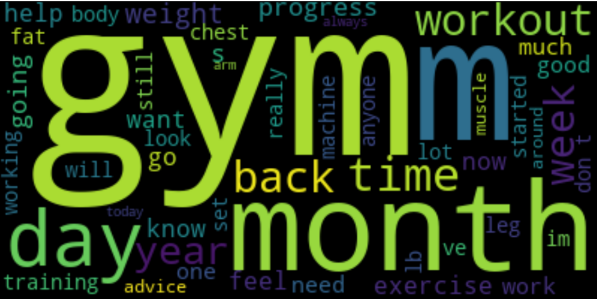
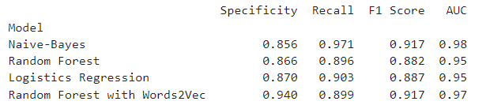

# Problem Statement

The pandemic has had a significant impact on Gyms and Yoga studios, leading to decreased revenue and increased competition from virtual classes. The rising inflation costs also affect the sustainability of the Gyms and Yoga Studios

As these businesses begin to recover with the loosening of the Covid restrictions, the owners of Gyms and Yogo Studios need to innovate their marketing efforts to attract new and old members, and social media advertising is a promising avenue. 

However, the problem is that it can be challenging to send the correct marketing ads to the appropriate audience without accurate classification of gym and yoga-related posts on social media platforms such as Reddit.

Hence, we need to find good classification methods that accurately distinguish these posts, and send correct targeted ads to the appropriate audience.

## Overview

With the loosening of pandemic restrictions, gyms and yoga studios are slowly starting to recover from the negative impact of the pandemic in terms of loss revenue, decreased membership, and increased competition from virtual classes.. Gym and yoga studio owners need to innovate their marketing efforts to attract new members and adapt to the changing fitness landscape. And one method is advertising through social media such as Reddit.

Reddit is the seond most popular social media platform here in Singapore. Reddit is a social media platform that allows users to create and participate in online communities called "subreddits". These subreddits are dedicated to specific topics, interests, or communities and users can submit content, such as links, text posts, and images, and participate in discussions and debates. In this project, I would like to understand what people posts about two topics:
- Gym
- Yoga

As a team of data scientists in Finesse Fit Solutions, the objectives of this project are to accurately classify gym and yoga-related posts on Reddit, and to send targeted ads to the appropriate audience.

## Project Workflow
Firstly, a python program will be designed that webscrapes these posts from a social platform (Reddit) using PRAW. PRAW stands for Python Reddit API Wrapper. It is a Python package that provides a simple and easy-to-use interface for accessing Reddit's API (Application Programming Interface).

Secondly, Natural Language Processing (NLP) python algorithm program will be used to tokenize/lemmatize the words in posts related to these two topics for the computer to understand. 

Lastly, classification models such as Multinomial Naive-Bayes (baseline model) and RandomForest Classifier will be used to determine which posts come from which sub-Reddit (Gym or Yoga).

## Data Collection

About 1000 posts from each subreddit Gym and Yoga were web scraped from Reddit r/gym and r/yogamotivation using the PRAW method. 

## EDA

### Data Cleaning

Each of the posts were stored in dataframes, and were checked for any null values or duplicates. 

### Data Visualizations

Wordcloud was used to see the 50 most common tokens in each topic.

Gym WordCloud
</img>

Yoga WordCloud
</img>

### Data Export

The cleaned data are exported out to their respective gym.csv and yoga.csv in the datasets folder.

## Preprocessing

Created 2 dataframes: gym and yoga. Each dataframe comes with columns: 'comments' and 'yoga_yes'. Setting 'yoga_yes'=0 for those comments that came from Gym posts and 'yoga_yes'=1 for those comments that came from Yoga posts

gym dataframe
</img>

yoga dataframe
</img>

Then concatenate both gym and yoga in a single dataframe yg_gym.

yg_gym dataframe
</img>

### NLP Processing Steps

1. Tokenization the all the comments in yg_gym.
2. Lemmatization all the token words in yg_gym.
3. TfidfVectorizer the tokenized/lennatized words.

</img>

**Note** Word2Vec is applied to the fourth classification model before TfidfVectorizer (Random Forest with Word2Vec)

## Modeling

Four Machine Learning models will be used here to classify the tokenized/lemmatized posts. And we will see the model performance metrics score, Confusion Matrix Display and the ROC curve to determine which is the best performing model.

The models used are:
- Multinomial Naive-Bayes
- Random forest Classifier
- Logistics Regression
- Random Forest Classifier with Word2Vec Embedding

### Naive-Bayes
</img>

Binary Classification Model Scores for Naive-Bayes:

</img>

Naive-Bayes Confusion Matrix plot
</img>

Naive-Bayes ROC
</img>

### Random Forest
</img>

Binary Classification Model Scores for Random Forest:

</img>

Random Forest Confusion Matrix plot
</img>

Random Forest ROC
</img>

### Logistics Regression

Binary Classification Model Scores for Logistics Regression:

</img>

Logistics Regression Confusion Matrix plot
</img>

Logistics Regression ROC
</img>

### Random Forest with Word2Vec

Binary Classification Model Scores for Random Forest with Word2Vec:

</img>

Random Forest with Word2Vec Confusion Matrix plot
</img>

Random Forest with Word2Vec ROC
</img>

### Overall Confusion Matrix Analysis

</img>

</img>

Naive-Bayes model may be overly biased towards predicting Yoga posts, leading to an increased number of False Positives. This means that the model is incorrectly classifying some Gym posts as Yoga posts, which could be problematic in this NLP binary classification case.

For the Random Forest Classifier model, there is an increased in the False Negatives as compared to the Naive-Bayes model. This model is not so good in identifying Gym posts as compared to the Naive-Bayes.

For the Logistics Regression model, there is an increased in the False Negatives as compared to the Naive-Bayes model. This model is not so good in identifying Gym posts as compared to the Naive-Bayes. The Confusion Matrix Display for Logistics Regression is similar to Random Forest Classifier.

For the Random Forest Classifier with Word2Vec model, the False Negatives is lesser to the Random Forest model but higher than the Naive-Bayes model and slightly higher than Logistics Regression. It is not so good in predicting Gym posts as compared to the Naive-Bayes model. But the False Positives is the  lowest among the three models, so the Random Forest Classifier with Word2Vec model is better at predicting Yoga posts.

## Conclusions

</img>

Based on the provided evaluation metrics table, the Random Forest model with Words2Vec embedding has the highest for specificity and F1 score, and the AUC is considered very good for the model. 

The recall score for Random Forest Classifier with Word2Vec model is similar to Random Forest Classifier and Logistics Regression, but it's much lower as compared to Naive-Bayes model. But, Naive-Bayes model is heavily biased in predicting Yoga posts.

The Random Forest with Word2Vec model has lower False Positives and False Negatives as compared to the Random Forest model. The Random Forest with Word2Vec model has lower False Positives and similar False Negatives as compared to the Logistics Regression model.

Therefore, it can be concluded that this model is the best performing model among the four models evaluated. 

Referring back to the Problem Statement, the Random Forest Classifier with Word2Vec model is able to distinguish posts that are yoga-related or gym-related. Therefore with this model's classification ability, Finesse Fit Solutions can use it to aid Gyms and Yoga Studios to send the correct marketing materials to the appropriate Reddit users.

## Recommendations

The Random Forest with Word2Vec classification model could be used to help businesses in the fitness industry understand their customers better. For example, a gym or yoga studio owner could use the program to analyze feedback from their customers and see what aspects of their services are most appreciated. They could then use this information to improve their offerings and attract more customers.

For Gym posts:

- The most common types of protein shakes or bars that are mentioned in the Gym posts, and can be used by nutrition companies to develop new products or marketing strategies.
- The sentiment of the Gym posts related to protein shakes or bars provide insights into the attitudes and opinions of the Gym community towards these supplements and can be used to identify potential issues or concerns.
- The type of Gym accessories required such as wrist straps or weightlifting belts being discussed provide insights into identifying what are the common brands of gym accessories being used in the Gym, and use this information to work with the gym accessories seller and disseminate any Gym accessories promotional offers to the adequate Gym audience.

For Yoga posts:

- Identify the most popular or commonly discussed yoga practices or techniques. Yoga Studios can use this information to develop new classes, workshops, or training programs.
- Analyze the sentiment of the Yoga posts can provide insights into the attitudes and opinions of the Yoga community towards different yoga practices and can be used to identify potential issues or concerns.
- Extract information about the most common yoga-related products, such as mats, blocks, and straps. This can be used by companies to develop new products or marketing strategies.
- Analyze the frequency of discussions or questions related to meditation or mindfulness practices to have a better understanding of the importance of these practices for the Yoga community.

The model can be used to filter or categorize new posts automatically for any other social platforms besides Reddit. 